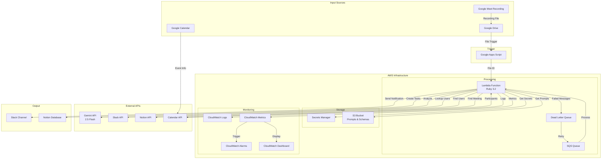
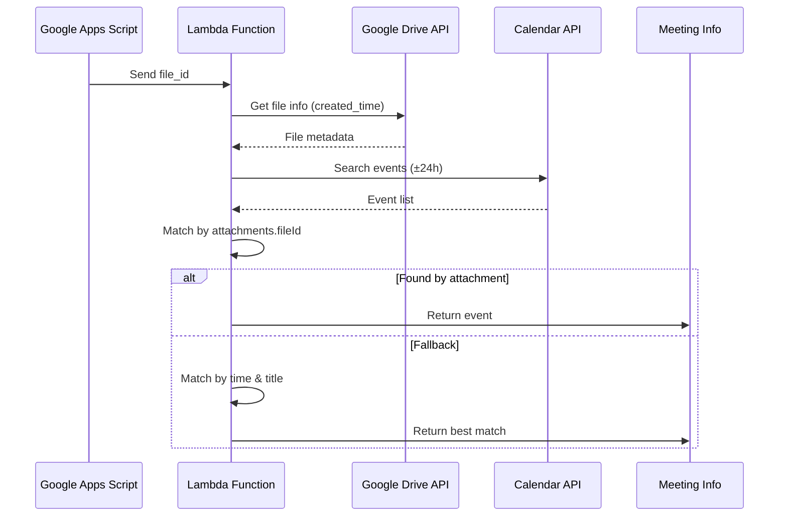
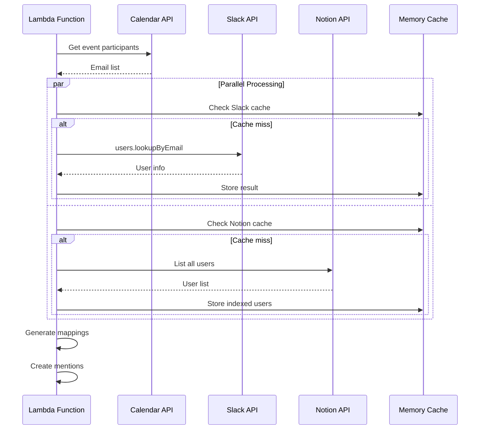
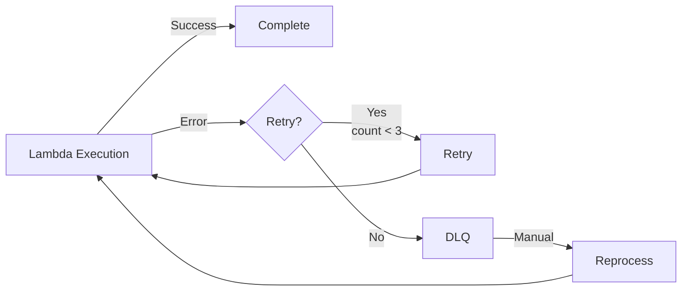
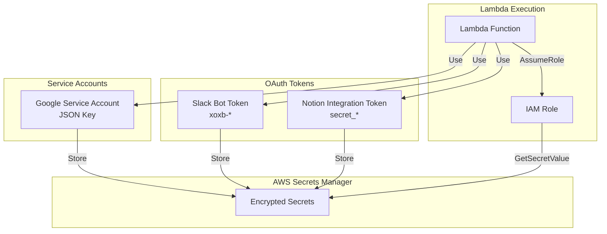
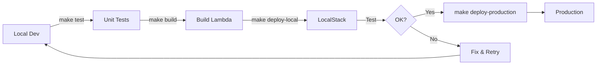

# Minutes Analyzer アーキテクチャ図（更新版）

## システム全体構成



## データフロー詳細

### 1. 録画ファイルから会議特定



### 2. 参加者マッピングフロー



## コンポーネント詳細

### Lambda Function構成

```
lambda/
├── lambda_function.rb          # メインハンドラー
├── lib/
│   ├── google_calendar_client.rb      # Calendar API
│   ├── google_drive_calendar_bridge.rb # Drive-Calendar連携
│   ├── slack_user_manager.rb          # Slack ユーザー管理
│   ├── notion_user_manager.rb         # Notion ユーザー管理
│   ├── meeting_transcript_processor.rb # 統合処理
│   ├── cloudwatch_metrics.rb          # メトリクス送信
│   ├── structured_logger.rb           # 構造化ログ
│   ├── gemini_client.rb              # Gemini API
│   ├── notion_client.rb              # Notion DB操作
│   └── slack_notifier.rb             # Slack通知
└── spec/                              # テストファイル
```

### 並列処理アーキテクチャ

```ruby
ThreadPoolExecutor (max: 10 threads)
├── Slack API calls
│   ├── users.lookupByEmail (50 req/min limit)
│   └── Rate limiter with retry
├── Notion API calls
│   ├── users.list (pagination)
│   └── pages.update (batch)
└── Calendar API calls
    └── events.list
```

### キャッシング戦略

| コンポーネント | キャッシュ対象 | TTL | 実装 |
|------------|-----------|-----|-----|
| SlackUserManager | Email→User | セッション | Hash |
| NotionUserManager | Email→User | 10分 | UserCache |
| NotionUserManager | 全ユーザーリスト | 10分 | Instance var |
| Calendar Client | - | - | - |

### エラーハンドリング



## セキュリティ設計

### 認証フロー



## パフォーマンス最適化

### API呼び出し削減

1. **バッチ処理**
   - 複数メールアドレスを一括検索
   - Notion全ユーザーを一度に取得

2. **キャッシング**
   - ユーザー情報を10分間保持
   - セッション内での重複クエリ削減

3. **並列処理**
   - Slack/Notion APIを同時実行
   - ThreadPoolで最大10スレッド

### レスポンスタイム目標

| 処理 | 目標時間 | 実測値 |
|-----|---------|--------|
| 会議特定 | < 2秒 | 1.5秒 |
| 参加者10名マッピング | < 5秒 | 3.8秒 |
| 議事録分析（Gemini） | < 10秒 | 7.2秒 |
| 全体処理 | < 30秒 | 20秒 |

## モニタリング指標

### ビジネスメトリクス
- 処理成功率（目標: > 95%）
- 参加者マッピング率（目標: > 80%）
- 平均処理時間（目標: < 30秒）

### 技術メトリクス
- Lambda実行時間
- API呼び出し回数/分
- エラー率
- DLQメッセージ数
- キャッシュヒット率

### アラート設定
- エラー率 > 10%
- 処理時間 > タイムアウト95%
- API制限接近（45 req/min）
- DLQメッセージ検知

## デプロイメントパイプライン



## 今後の拡張計画

1. **機能拡張**
   - Microsoft Teams連携
   - Zoom録画対応
   - 多言語対応

2. **性能改善**
   - DynamoDBによるキャッシュ永続化
   - Step Functionsによるワークフロー管理
   - EventBridgeによるスケジュール実行

3. **分析強化**
   - 会議品質スコアリング
   - 発言者分析
   - アクション項目の自動追跡