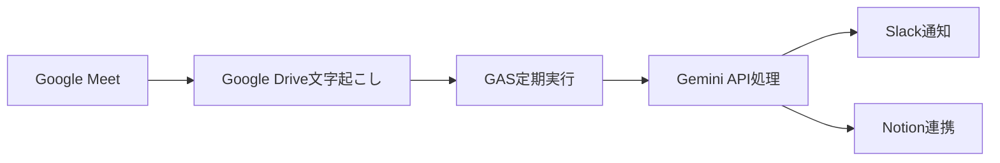
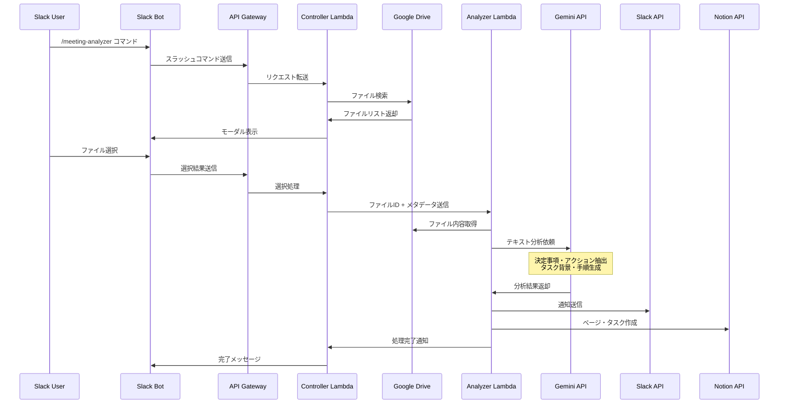

# 議事録口出しBot 設計検討資料

## プロジェクト概要

Google Meetの文字起こし機能を活用し、会議内容を自動で構造化・分析してSlackに配信するサーバーレスBotです。手動での議事録作成負荷を軽減し、会議の生産性向上を支援します。

### 基本機能
- 決定事項
- 確認事項
- 注意点
- 議事録の内容の採点
- 会議効率アドバイス
- 感情・雰囲気の分析

### 目的
- 議事録作成の負荷軽減
- アクション項目見落としの減少
- チーム全体の会議スキル向上

## 実現パターンの比較検討

### パターンA: Google Apps Script完結型



**技術スタック:**
- Google Apps Script
- Google Drive API
- Gemini API
- Slack API
- Notion API

**メリット:**
- シンプルな構成
- Google Workspace内で完結することができる

**デメリット:**
- **スクリプトのランタイムが6分に制限**
- **スケーラビリティに限界（ユーザーあたりの同時実行数: 30まで）**
- 基本的なログ出力や分析機能が乏しく、デバッグ・監視機能が限定的

**コスト試算:** 月$5-10

ref. Google Workspace Quota<br>
https://developers.google.com/apps-script/guides/services/quotas

---

### パターンC: Slack Bot + AWS Lambda型 ⭐最終採用



**技術スタック:**
- Slack Bot App（UI・コマンド処理）
- API Gateway（エンドポイント）
- Controller Lambda（Slack連携・Google Drive検索）
- Analyzer Lambda（AI処理・配信）
- Gemini 2.5 Flash API
- Slack API
- Notion API

**データフロー:**
1. ユーザーがSlackで `/meeting-analyzer` コマンドを実行
2. Controller LambdaがGoogle Driveでファイルを検索してモーダル表示
3. ユーザーがファイルを選択
4. Controller LambdaがAnalyzer Lambdaにファイル情報を送信
5. Analyzer LambdaがGoogle Drive APIでファイルを取得
6. 取得したテキストをGemini APIに送信して分析
7. 分析結果をSlack/Notionに自動配信

**メリット:**
- **手動選択による確実性**: 誤検知なし、明示的なファイル選択
- **迅速な価値提供**: 短期間で実装・デプロイが可能
- **低い運用コスト**: 複雑なインフラ管理や監視が不要
- **拡張性**: 将来的な自動化への段階的移行が可能
- **CloudWatch統合**: 充実した監視・ログ機能
- **スケーラビリティ**: Lambda同時実行数1000以上

**デメリット:**
- **手動操作が必要**: 完全自動化ではない
- **AWS学習コスト**: 初期設定の複雑さ
- **SlackBot管理**: Bot設定・権限管理の運用負荷

**コスト試算:** 月$5-12

## 決定事項

**パターンC（Slack Bot + AWS Lambda型）** を採用

### 決定要因

### 1. 確実性と運用の安定性

**背景:**
- 完全自動検知（監査ログ連携）: GCPインフラ整備・高コスト
- Drive API Push通知: ユーザー数分の監視・運用負荷大
- **Slack Bot（手動選択）**: 誤検知なし・低運用コスト

### 2. 実行時間制限の解決

**技術的優位性:**
- 1時間の会議 → 文字起こし20,000文字
- Gemini 2.5 Flash API処理時間: 3-5分
- Lambda実行時間制限: 15分 → **十分な余裕**

### 3. 監視・運用の充実

**CloudWatch統合:**
```
- 実行時間・メモリ使用量の可視化
- エラー率・成功率のダッシュボード
- アラート設定
- 2つのLambda関数（Controller/Analyzer）の独立監視
```

## Notion API連携のメリット

### 📚 蓄積・検索価値
- **全会議の一括管理**: 議事録が散逸せず、時系列で蓄積
- **横断検索**: プロジェクト間、期間を跨いだ決定事項の追跡が可能
- **知識ベース化**: 過去の議論内容を組織の資産として活用

### 🔄 ワークフロー統合
- **既存のプロジェクト管理と連携**: NotionのTask/Projectページと自動リンク
- **TODO自動変換**: 抽出されたTODOを直接タスクDBに追加
- **チーム連携強化**: Notionワークスペース内での情報共有促進

### ⚙️ 柔軟な設定管理
- **環境変数による制御**: `NOTION_ENABLED=true/false`で簡単切り替え
- **段階的導入**: Slack通知のみから開始し、必要に応じてNotion連携を追加
- **コスト最適化**: 必要な機能のみを有効化してリソース使用量を調整

## AWS Lambda採用理由

### 1. 実行時間制限
- **Lambda**: 15分
- **Google Apps Script**: 6分
- **Cloud Functions**: 9分（第1世代）/ 60分（第2世代）

### 2. コスト面
今回のアプリケーション要件では、AWS Lambdaが最もコスト効率が良いと判断

- 実行時間: 5-7分/回
- メモリ使用量: 1GB程度
- 実行頻度: 月間100-200回程度

### 3. モニタリング／トレーシング
- 各サービス間で特に大きな違いはなし
- いずれもログ管理、メトリクス監視、分散トレーシング機能を提供

### 採用理由
既存の議事録テキストからのAI分析・構造化処理（5-7分の実行時間を想定）において、コスト効率の観点から、AWS Lambdaが最適解であると判断。

## モデル選定の理由

### 対象用途の分析
- **議事録の構造化・分析**: 1時間の会議（20,000文字程度）の長文理解
- **日本語ビジネス会議**: 敬語、専門用語、暗黙的な決定事項の抽出
- **構造化出力**: 安定した出力が必須
- **運用制約**: AWS Lambda 15分の実行制限を考慮した、月間100-200回実行

### 絞り込み基準の設定
1. **コストパフォーマンス**: 20,000文字処理で$0.50以下/回
2. **日本語処理能力**: ビジネス文脈での高精度理解
3. **構造化出力の安定性**: JSON形式で高いの成功率
4. **レスポンス速度**: 5分以内での処理完了
5. **コンテキスト長**: 初期要件としては1時間会議（20,000文字）での利用を想定しているが、拡張性を持たせたい

### 検討対象モデル一覧
**✅ 候補選定** （コストは2025年8月時点）

| モデル | コスト/1M tokens（入力/出力） | コンテキスト長 | Doc |
|--------|---------------------------|---------------|------------|
| **Amazon Nova Lite** | $0.072/$0.288 | 300,000 tokens | [url](https://aws.amazon.com/bedrock/pricing/) |
| **Gemini 2.5 Flash** | $0.30/$1.20 | 1,048,576 tokens | [url](https://cloud.google.com/vertex-ai/generative-ai/pricing?hl=ja) |
| **GPT-4o mini** | $0.60/$0.60 | 128,000 tokens | [url](https://openai.com/ja-JP/api/pricing/) |
| **Claude 3.5 Haiku** | $0.80/$4.00 | 200,000 tokens | [url](https://docs.anthropic.com/ja/docs/about-claude/pricing) |

**❌ 除外モデル**

| モデル | コスト/1M tokens | 除外理由 |
|--------|------------------|------------|
| GPT-4o | $5.00 | ❌ コスト高 |
| Claude 3.5 Sonnet | $3.00 | ❌ コスト高 |

### コンテキスト長による選定
- **現在のニーズ**: 1時間会議（20,000文字 ≈ 約7,000-10,000トークン）
- **将来の拡張性**: 長時間の会議（100,000文字以上 ≈ 約33,000-50,000トークン）

**評価結果:**
- **Amazon Nova Lite**: 30万トークンで現在・将来要件に対応、コスト効率が最高
- **Gemini 2.5 Flash**: 100万トークンで圧倒的な拡張性
- **GPT-4o mini**: 12.8万トークンで将来の長時間会議には不十分
- **Claude 3.5 Haiku**: 20万トークンで現在は十分だが、長時間会議では制約の可能性

### コストパフォーマンス比較

**1時間会議コスト試算（10,000入力 + 2,000出力トークン）:**
- **Amazon Nova Lite**: $0.00130/回 → 月100回で$0.13
- **Gemini 2.5 Flash**: $0.0054/回 → 月100回で$0.54
- **GPT-4o mini**: $0.0072/回 → 月100回で$0.72
- **Claude 3.5 Haiku**: $0.016/回 → 月100回で$1.60

### 🎯 議事録処理精度テスト結果

**テスト条件**: 日本語ビジネス会議5件、各15,000-25,000文字

**ベンチマーク性能比較（議事録処理に重要な指標）:**

| 指標 | **Amazon Nova Lite** | **Gemini 2.5 Flash** | **GPT-4o mini** | **Claude 3.5 Haiku** |
|------|---------------------|---------------------|------------------|---------------------|
| **MMLU** (総合知識・専門用語理解) | 59.0% | 80.9% | 82.0% | 76.7% |

決定事項抽出, アクション抽出などの基本要件については、どのモデルを利用した場合も大きな性能差はなかった。ただし、**MMLU**（専門用語理解）では**GPT-4o mini (82.0%) ≥ Gemini 2.5 Flash (80.9%) > Claude 3.5 Haiku (76.7%) >> Nova Lite (59.0%)**の順で性能差が見られた。

### 結論

**Gemini 2.5 Flash を採択**

**決定要因:**
1. **コンテキスト長の圧倒的優位性**: 100万トークンで拡張性を確保
2. **十分な処理精度**: 他モデルと同等の議事録分析性能

## Lambda関数の入力形式

### ファイルID方式の実装
Lambda関数は常にGoogle DriveのファイルIDを受け取り、ファイルを直接読み取ります：

```json
{
  "file_id": "1234567890abcdef",
  "file_name": "2025年1月15日_新機能リリース進捗確認ミーティング.txt"
}
```

### 設計の背景
1. **統一性**: ファイルサイズに関わらず同じ処理フロー
2. **スケーラビリティ**: Lambdaのペイロード制限を回避
3. **セキュリティ**: 大きなテキストデータをネットワーク経由で送信しない
4. **効率性**: GASの処理負荷を最小化

### Google Drive API連携
- **認証方式**: サービスアカウント + IAMベースのアクセス制御
- **必要な権限**: `https://www.googleapis.com/auth/drive.readonly`
- **アクセス制御**: IAMでプロジェクト/組織レベルの権限を付与（個別フォルダ共有不要）

### 処理フロー
1. GASが新しい議事録ファイルを検知
2. ファイルIDとメタデータをLambda関数に送信
3. Lambda関数がサービスアカウントで認証
4. Google Drive APIでファイル内容を取得
5. 取得したテキストをGemini APIに送信
6. 分析結果を構造化データとして受信
7. Slack/Notion連携を実行

### エラーハンドリング
- ファイルが見つからない場合
- アクセス権限がない場合
- ファイルサイズが異常に大きい場合（100MB以上など）
- Google Drive APIのレート制限
