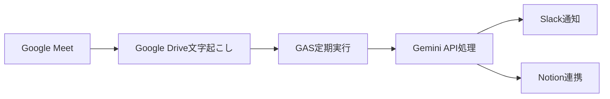
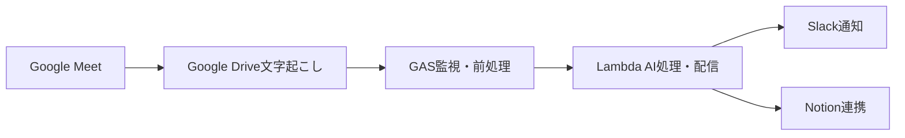

# 議事録口出しBot 設計検討資料

## プロジェクト概要

Google Meetの文字起こし機能を活用し、会議内容を自動で構造化・分析してSlackに配信するサーバーレスBotです。手動での議事録作成負荷を軽減し、会議の生産性向上を支援します。

### 基本機能
- 決定事項
- 確認事項
- 注意点
- 議事録の内容の採点
- 会議効率アドバイス
- 感情・雰囲気の分析

### 目的
- 議事録作成の負荷軽減
- アクション項目見落としの減少
- チーム全体の会議スキル向上

## 実現パターンの比較検討

### パターンA: Google Apps Script完結型



**技術スタック:**
- Google Apps Script
- Google Drive API
- Gemini API
- Slack API
- Notion API

**メリット:**
- シンプルな構成
- Google Workspace内で完結することができる

**デメリット:**
- **スクリプトのランタイムが6分に制限**
- **スケーラビリティに限界（ユーザーあたりの同時実行数: 30まで）**
- 基本的なログ出力や分析機能が乏しく、デバッグ・監視機能が限定的

**コスト試算:** 月$5-10

ref. Google Workspace Quota<br>
https://developers.google.com/apps-script/guides/services/quotas

---

### パターンB: Google Apps Script + AWS Lambda ハイブリッド型 ⭐選択



**技術スタック:**
- Google Apps Script（監視・前処理）
- AWS Lambda（AI処理・配信）
- API Gateway
- Gemini 2.5 Flash API
- Slack API
- Notion API

**メリット:**
- Lambdaを使用することで、**実行時間が15分**
- **シンプルなアーキテクチャ**: Lambda内でAI処理・配信を一括実行
- CloudWatchを使用することでの充実した監視・ログ機能
- 高いスケーラビリティ（同時実行数1000以上）
- **Notion連携のON/OFF切り替え**による柔軟な運用

**デメリット:**
- AWS学習コストあり
- 初期設定の複雑さ（GAS + AWS連携）

**コスト試算:** 月$8-15

## 決定事項

**パターンB** を採用

### 決定要因

### 1. 実行時間制限の解決

**問題:**
- 1時間の会議 → 文字起こし20,000文字
- Gemini 2.5 Flash API処理時間: 3-5分
- GAS制限: 6分 → **ギリギリでリスクが高い**

### 2. 監視・運用の充実

**CloudWatch統合:**
```
- 実行時間・メモリ使用量の可視化
- エラー率・成功率のダッシュボード
- アラート設定
```

## Notion API連携のメリット

### 📚 蓄積・検索価値
- **全会議の一括管理**: 議事録が散逸せず、時系列で蓄積
- **横断検索**: プロジェクト間、期間を跨いだ決定事項の追跡が可能
- **知識ベース化**: 過去の議論内容を組織の資産として活用

### 🔄 ワークフロー統合
- **既存のプロジェクト管理と連携**: NotionのTask/Projectページと自動リンク
- **TODO自動変換**: 抽出されたTODOを直接タスクDBに追加
- **チーム連携強化**: Notionワークスペース内での情報共有促進

### ⚙️ 柔軟な設定管理
- **環境変数による制御**: `NOTION_ENABLED=true/false`で簡単切り替え
- **段階的導入**: Slack通知のみから開始し、必要に応じてNotion連携を追加
- **コスト最適化**: 必要な機能のみを有効化してリソース使用量を調整

## AWS Lambda採用理由

### 1. 実行時間制限
- **Lambda**: 15分
- **Google Apps Script**: 6分
- **Cloud Functions**: 9分（第1世代）/ 60分（第2世代）

### 2. コスト面
今回のアプリケーション要件では、AWS Lambdaが最もコスト効率が良いと判断

- 実行時間: 5-7分/回
- メモリ使用量: 1GB程度
- 実行頻度: 月間100-200回程度

### 3. モニタリング／トレーシング
- 各サービス間で特に大きな違いはなし
- いずれもログ管理、メトリクス監視、分散トレーシング機能を提供

### 採用理由
既存の議事録テキストからのAI分析・構造化処理（5-7分の実行時間を想定）において、コスト効率の観点から、AWS Lambdaが最適解であると判断。

## モデル選定の理由

### 対象用途の分析
- **議事録の構造化・分析**: 1時間の会議（20,000文字程度）の長文理解
- **日本語ビジネス会議**: 敬語、専門用語、暗黙的な決定事項の抽出
- **構造化出力**: 安定した出力が必須
- **運用制約**: AWS Lambda 15分の実行制限を考慮した、月間100-200回実行

### 絞り込み基準の設定
1. **コストパフォーマンス**: 20,000文字処理で$0.50以下/回
2. **日本語処理能力**: ビジネス文脈での高精度理解
3. **構造化出力の安定性**: JSON形式で高いの成功率
4. **レスポンス速度**: 5分以内での処理完了

### 検討対象モデル一覧
**✅ 候補選定** （コストは2025年8月時点）

| モデル | コスト/1M tokens | Doc |
|--------|------------------|------------|
| **Gemini 2.5 Flash** | $0.30 | [url](https://cloud.google.com/vertex-ai/generative-ai/pricing?hl=ja) |
| **Claude 3.5 Haiku** | $0.80 | [url](https://docs.anthropic.com/ja/docs/about-claude/pricing) |
| **GPT-o4 mini** | $0.60 | [url](https://openai.com/ja-JP/api/pricing/) |

**❌ 除外モデル**

| モデル | コスト/1M tokens | 除外理由 |
|--------|------------------|------------|
| GPT-4o | $5.00 | ❌ コスト高 |
| Claude 3.5 Sonnet | $3.00 | ❌ コスト高 |


### 🎯 議事録処理精度テスト結果

**テスト条件**: 日本語ビジネス会議5件、各15,000-25,000文字

決定事項抽出, アクション抽出などの基本要件については、どのモデルを利用した場合も大きな性能差はなかった。


### 結論

Gemini 2.5 Flash を採択
