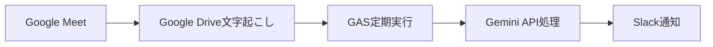
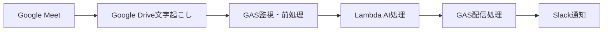

# 議事録口出しBot 設計検討資料

## プロジェクト概要

Google Meetの文字起こし機能を活用し、会議内容を自動で構造化・分析してSlackに配信するサーバーレスBotです。手動での議事録作成負荷を軽減し、会議の生産性向上を支援します。

### 基本機能
- 決定事項
- 確認事項
- 注意点
- 議事録の内容の採点
- 会議効率アドバイス
- 感情・雰囲気の分析

### 目的
- 議事録作成の負荷軽減
- アクション項目見落としの減少
- チーム全体の会議スキル向上

## 実現パターンの比較検討

### パターンA: Google Apps Script完結型



**技術スタック:**
- Google Apps Script
- Google Drive API
- Gemini API
- Slack API

**メリット:**
- シンプルな構成
- Google Workspace内で完結することができる

**デメリット:**
- **スクリプトのランタイムが6分に制限**
- **スケーラビリティに限界（ユーザーあたりの同時実行数: 30まで）**
- 基本的なログ出力や分析機能が乏しく、デバッグ・監視機能が限定的

**コスト試算:** 月$5-10

ref. Google Workspace Quota<br>
https://developers.google.com/apps-script/guides/services/quotas

---

### パターンB: Google Apps Script + AWS Lambda ハイブリッド型 ⭐選択



**技術スタック:**
- Google Apps Script（監視・配信）
- AWS Lambda（AI処理）
- API Gateway
- Gemini/Claude API
- Slack API

**メリット:**
- Lambdaを使用することで、**実行時間が15分**
- CloudWatchを使用することでの充実した監視・ログ機能
- 高いスケーラビリティ（同時実行数1000以上）

**デメリット:**
- 設定がやや複雑
- AWS学習コストあり

**コスト試算:** 月$6-12

## 決定事項

**パターンB** を採用

### 決定要因

### 1. 実行時間制限の解決

**問題:**
- 1時間の会議 → 文字起こし20,000文字
- Gemini API処理時間: 3-5分
- GAS制限: 6分 → **ギリギリでリスクが高い**

### 2. 監視・運用の充実

**CloudWatch統合:**
```
- 実行時間・メモリ使用量の可視化
- エラー率・成功率のダッシュボード
- アラート設定
```
