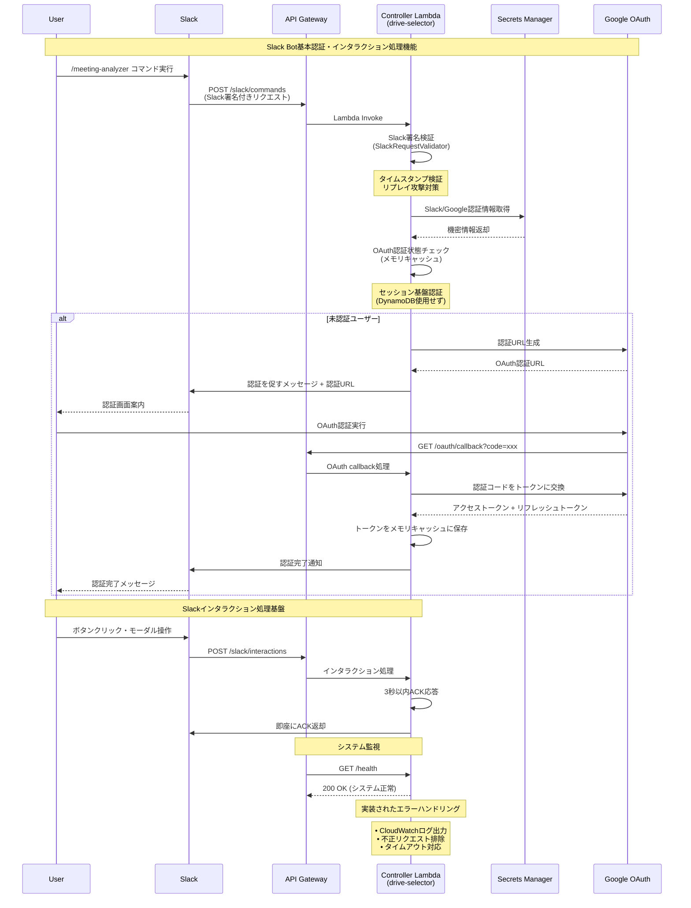
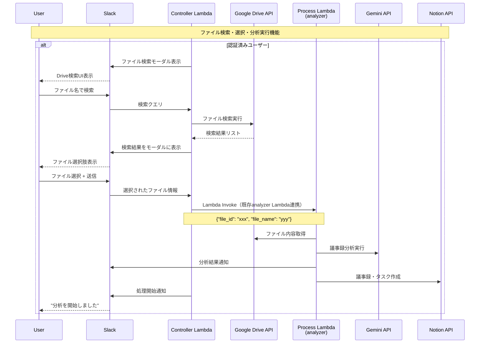

# Controller Lambda シーケンス図

本ドキュメントでは、Slack Bot（drive-selector）の基本機能とアーキテクチャを、実装済み機能と将来実装予定機能に分けて説明します。

## 実装済み機能範囲

## 将来実装予定の機能

## 実装されたコンポーネント

### 1. 基盤インフラストラクチャ
- **API Gateway**: Slackからのリクエスト受付
  - `/slack/commands` - Slashコマンド
  - `/slack/interactions` - インタラクション
  - `/oauth/callback` - OAuth認証
  - `/health` - ヘルスチェック

### 2. Controller Lambda (Ruby)
- **handler.rb**: ルーティングとエントリーポイント
- **SlackRequestValidator**: 署名検証とセキュリティ
- **SlackCommandHandler**: コマンド処理基盤
- **SlackInteractionHandler**: インタラクション処理基盤
- **GoogleOAuthClient**: OAuth認証（セッション基盤）

### 3. セキュリティ機能
- Slack署名検証によるリクエスト検証
- タイムスタンプ検証でリプレイ攻撃対策
- Secrets Managerによる機密情報管理
- IAMによる最小権限アクセス制御

### 4. 運用機能
- CloudWatch Logsによるログ管理
- エラーハンドリング
- 3秒ACK応答保証
- ヘルスチェックエンドポイント

## アーキテクチャ上の変更点

### KMS/DynamoDB除去
- **Before**: OAuth トークンをDynamoDBで永続化、KMSで暗号化
- **After**: セッション基盤でメモリ内キャッシュ、暗号化なし

### セッション基盤認証のメリット
1. **シンプル**: 複雑なデータベース管理が不要
2. **低コスト**: DynamoDB・KMSの課金なし
3. **高速**: メモリアクセスで高速動作
4. **セキュア**: Lambdaコンテナ内でのみ保持

### セッション基盤認証の制約
1. **一時的**: Lambdaコンテナ再起動でトークン失効
2. **単一セッション**: 複数デバイス間での認証状態共有不可

この制約は、議事録分析という用途では許容範囲内と判断されます。
