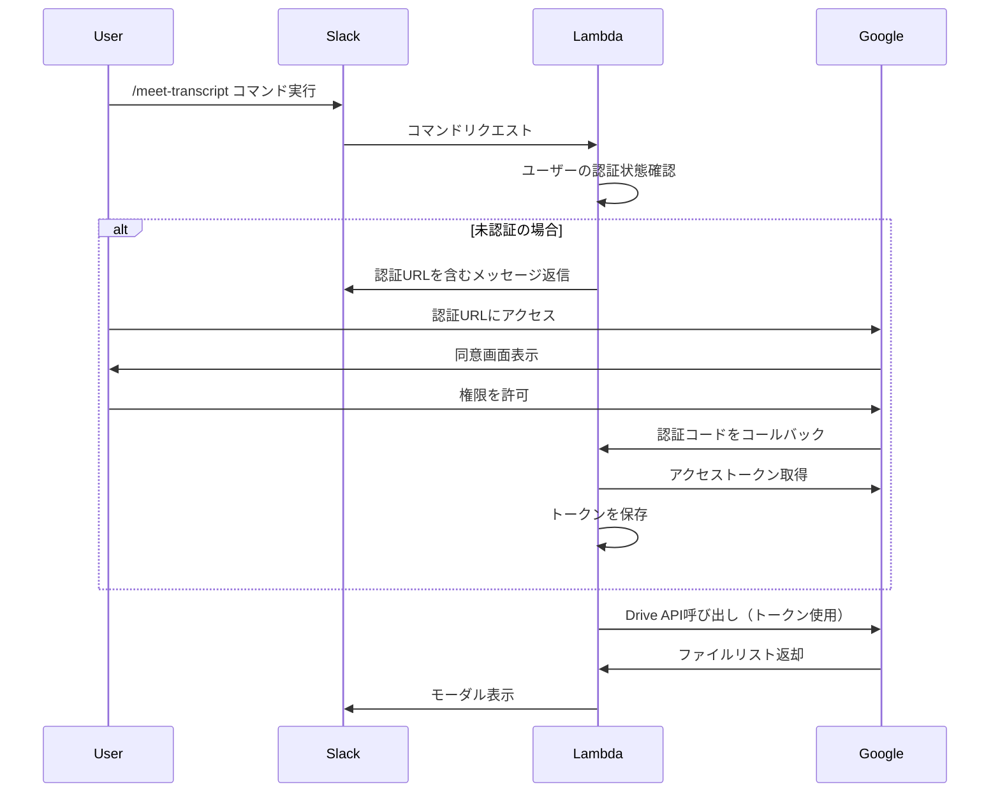

# Google OAuth 2.0設定手順（T-02）

## 概要
Google Drive APIへのアクセスのために、OAuth 2.0認証を設定します。
ユーザー認証方式を採用することで、Google Workspace以外の環境でも動作可能にします。

## 前提条件
- Google Cloud Platformアカウントが作成済みであること
- プロジェクトが作成済みであること
- 課金アカウントが設定済みであること（無料枠内で利用可能）

## 設定手順

### 1. Google Drive APIの有効化

1. [Google Cloud Console](https://console.cloud.google.com) にアクセス
2. プロジェクトを選択
3. 「APIとサービス」→「ライブラリ」を選択
4. 「Google Drive API」を検索
5. 「有効にする」をクリック

### 2. OAuth同意画面の設定

1. 「APIとサービス」→「OAuth同意画面」を選択
2. ユーザータイプを選択：
   - 組織内のみ: 「内部」
   - 一般公開: 「外部」
3. 必須項目を入力：
   ```
   アプリ名: Minutes Analyzer Drive Selector
   ユーザーサポートメール: [あなたのメールアドレス]
   開発者の連絡先情報: [あなたのメールアドレス]
   ```
4. スコープを追加：
   - `.../auth/drive.metadata.readonly` - Google Driveのメタデータ読み取り
5. テストユーザーを追加（外部の場合）

### 3. OAuth 2.0クライアントIDの作成

1. 「APIとサービス」→「認証情報」を選択
2. 「認証情報を作成」→「OAuth クライアント ID」を選択
3. アプリケーションの種類: 「ウェブアプリケーション」
4. 名前: `Minutes Analyzer Drive Selector`
5. 承認済みのリダイレクトURIを追加：
   ```
   開発環境: http://localhost:3000/oauth/callback
   本番環境: https://[API_GATEWAY_URL]/oauth/callback
   ```
6. 「作成」をクリック

### 4. 認証情報の取得と保存

作成後に表示される以下の情報を安全に保存してください：
- **クライアントID**: `GOOGLE_CLIENT_ID`として環境変数に設定
- **クライアントシークレット**: `GOOGLE_CLIENT_SECRET`として環境変数に設定

また、JSONファイルをダウンロードして保管することも推奨します。

## OAuth認証フローの概要



## セキュリティ考慮事項

### トークンの保管
- アクセストークンとリフレッシュトークンは暗号化して保存
- DynamoDBまたはSecrets Managerを使用
- ユーザーIDと紐付けて管理

### スコープの最小化
- 必要最小限のスコープのみを要求
- `drive.metadata.readonly`のみで、ファイル内容の読み取りは行わない

### トークンの有効期限管理
- アクセストークンの有効期限（通常1時間）を考慮
- リフレッシュトークンを使用した自動更新を実装

## 環境変数設定

以下の環境変数を設定してください：

```bash
# Google OAuth設定
GOOGLE_CLIENT_ID=your_client_id_here
GOOGLE_CLIENT_SECRET=your_client_secret_here

# オプション（開発環境用）
GOOGLE_OAUTH_BASE_URL=https://accounts.google.com/o/oauth2/v2
GOOGLE_TOKEN_URL=https://oauth2.googleapis.com/token
```

## トラブルシューティング

### 「リダイレクトURIが一致しません」エラー
- OAuth クライアントIDの設定で、正確なリダイレクトURIが登録されているか確認
- HTTPSとHTTP、末尾のスラッシュの有無に注意

### 「スコープが承認されていません」エラー
- OAuth同意画面でスコープが正しく設定されているか確認
- テストユーザーとして登録されているか確認（外部アプリの場合）

### トークンの有効期限切れ
- リフレッシュトークンを使用した更新処理が実装されているか確認
- リフレッシュトークンが正しく保存されているか確認

## 次のステップ
1. ユーザーによるGoogle Cloud Console設定の実施
2. 環境変数の設定
3. T-05でOAuth認証フローの実装コードを作成
